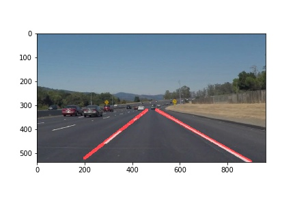

#**Finding Lane Lines on the Road** 

##Writeup Template

###You can use this file as a template for your writeup if you want to submit it as a markdown file. But feel free to use some other method and submit a pdf if you prefer.

---

**Finding Lane Lines on the Road**

The goals / steps of this project are the following:
* Make a pipeline that finds lane lines on the road
* Reflect on your work in a written report


[//]: # (Image References)

[image1]: ./examples/grayscale.jpg "Grayscale"

---

### Reflection

###1. Pipeline description.

The pipeline consisted of 9 steps.

1. The image is converted to gray scale.

2. Gaussian filter is applied.

3. Canny edge detection is applied.

4. A region of interest is selected. A triangle with dimensions:
```left_bottom = (0, y_size), right_bottom = (x_size, y_size), apex = (480, 305)```

5. Hough lines detection.

6. Separate left lines from right lines using the slope of the lines.

7. Find extreme values (min x, max x, min y etc.) in the set of left lines. The left line is a line connecting its min values to its max values. Repeat the same procedure for the set of right lines.

8. Extrapolate the left line by fitting y = Ax+B line to it and extnding it to the bottom of the image. Repeat the same for the right line.

9. Draw the lins on the initial image. 

The result form the test images and videos can be found [here](./result)




###2. shortcomings with the current pipeline


It will not work on turns because the slope of the lines will change.

It will not work if the angle of the camera or the size of the image is different.

###3. Possible improvements to the pipeline

Find a way to cope with lines having slope of 0.